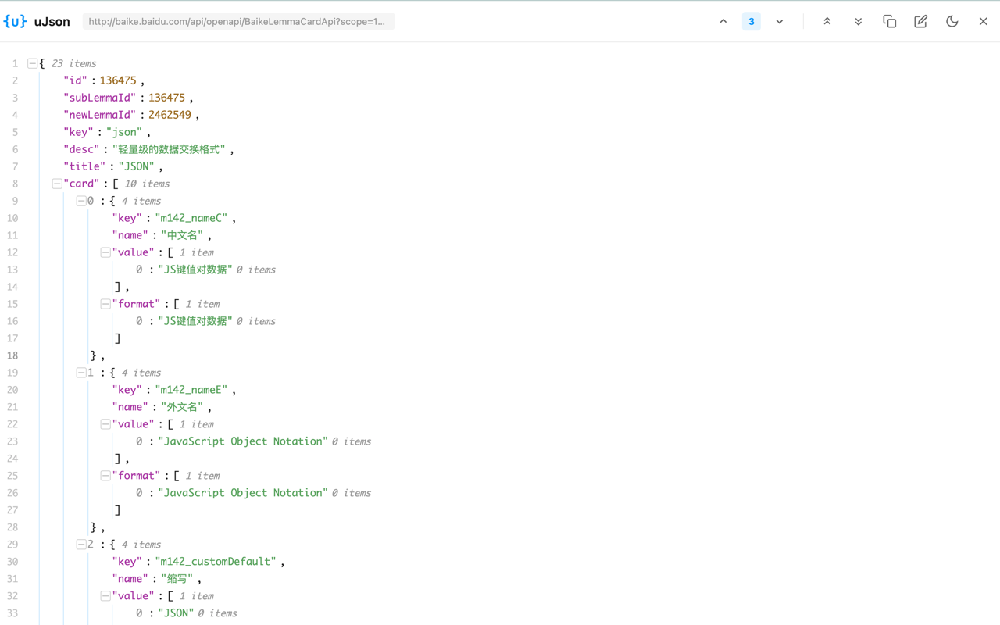
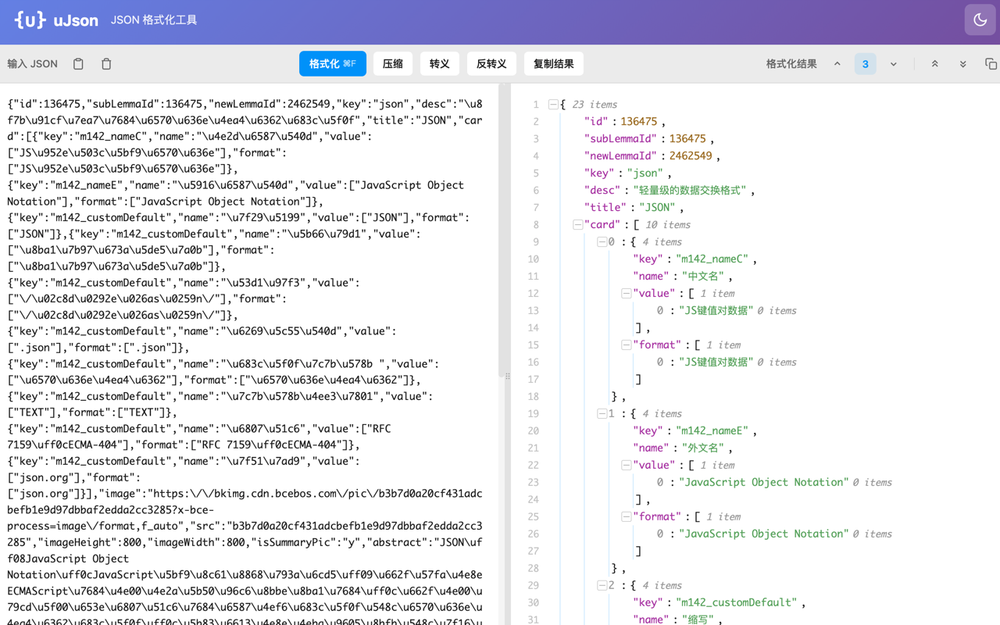

# uJson - JSON Formatter & Viewer

<p align="center">
  
</p>

<p align="center">
  <strong>A lightweight Chrome extension for formatting and viewing JSON data</strong>
</p>

<p align="center">
  <a href="#features">Features</a> •
  <a href="#installation">Installation</a> •
  <a href="#usage">Usage</a> •
  <a href="#development">Development</a>
</p>

---

## ✨ Features

- 🚀 **Auto Detection** - Automatically formats JSON when visiting API endpoints
- 🌳 **Tree View** - Collapsible tree structure with line numbers
- 🎨 **Syntax Highlighting** - Color-coded JSON keys, values, and types
- 🌙 **Dark Mode** - Toggle between light and dark themes
- 📋 **Copy & Edit** - One-click copy, built-in JSON editor
- 🔧 **Format Tools** - Format, compress, escape, and unescape JSON
- 🐍 **Python Dict Support** - Parse Python dict format (single quotes, True/False/None)
- ➕ **Trailing Comma** - Tolerant parsing of trailing commas

## 📸 Screenshots

| Viewer                                | Editor                                | Dark Mode                           |
| ------------------------------------- | ------------------------------------- | ----------------------------------- |
|  |  |  |

## 📦 Installation

### Chrome Web Store

[](https://chromewebstore.google.com/detail/ujson-json-formatter-view/nahpjpifcdnkjcfoikglibgikhnkachl)

👉 [Install from Chrome Web Store](https://chromewebstore.google.com/detail/ujson-json-formatter-view/nahpjpifcdnkjcfoikglibgikhnkachl)

### Manual Installation

1. Download or clone this repository
2. Run `npm install && npm run build`
3. Open `chrome://extensions/` in Chrome
4. Enable "Developer mode"
5. Click "Load unpacked" and select the `dist` folder

## 🎯 Usage

### Auto Format

Simply visit any URL that returns JSON data - the extension will automatically detect and format it.

### Manual Editor

1. Click the extension icon in toolbar
2. Paste your JSON in the left panel
3. View formatted result in the right panel

### Toolbar Actions

| Button | Action                    |
| ------ | ------------------------- |
| ↑/↓    | Collapse/Expand one level |
| ⇈/⇊    | Collapse/Expand all       |
| 📋      | Copy to clipboard         |
| 🌙/☀️    | Toggle theme              |

### Keyboard Shortcuts

- `⌘/Ctrl + F` - Format JSON

## 🛠 Development

### Prerequisites

- Node.js 16+
- npm or yarn

### Setup

```bash
# Install dependencies
npm install

# Development build with watch
npm run dev

# Production build
npm run build
```

### Project Structure

```
ujson/
├── manifest.json          # Extension manifest
├── package.json           # Dependencies
├── vite.config.js         # Build config
├── viewer.html            # Auto-format page
├── editor.html            # Editor page
├── icons/                 # Extension icons
├── src/
│   ├── background.js      # Service worker
│   ├── content.js         # Content script
│   ├── ViewerApp.vue      # Viewer component
│   ├── EditorApp.vue      # Editor component
│   ├── components/        # Vue components
│   │   ├── JsonViewer.vue
│   │   ├── JsonNode.vue
│   │   └── JsonValue.vue
│   ├── utils/
│   │   └── jsonFormat.js  # JSON utilities
│   └── styles/
│       └── theme.css      # Theme variables
└── dist/                  # Build output
```

## 🔧 Tech Stack

- **Framework**: Vue 3 + Composition API
- **Build Tool**: Vite
- **Extension**: Chrome Manifest V3

## 📄 License

MIT License - see [LICENSE](LICENSE) for details.

## 🔒 Privacy

This extension does not collect any user data. See [Privacy Policy](PRIVACY.md) for details.

## 🤝 Contributing

Contributions are welcome! Please feel free to submit a Pull Request.

1. Fork the repository
2. Create your feature branch (`git checkout -b feature/amazing`)
3. Commit your changes (`git commit -m 'Add amazing feature'`)
4. Push to the branch (`git push origin feature/amazing`)
5. Open a Pull Request

## 📮 Feedback

If you have any questions or suggestions, please [open an issue](../../issues).

---

<p align="center">Made with ❤️ by uuhc</p>
